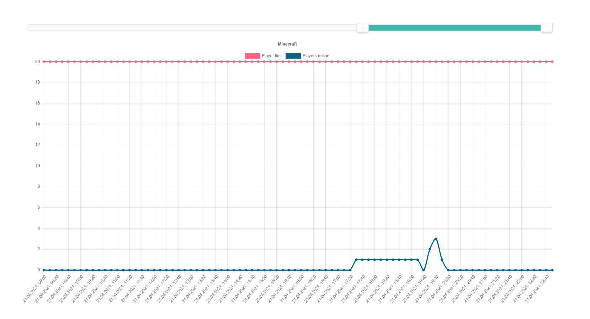
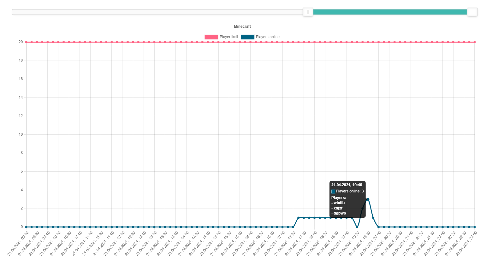

# Minecraft-scraper
This Program looks up the amount and names of players on a given Minecraft-server. It is easily configurable with the below named files.

&nbsp;

# Example-Images


This is how the frontend looks normally

&nbsp;


When hovered over a specific point, the playerlist at that specific time is shown

# Installation

For installation [nodejs](https://nodejs.org/) is needed. To start the application, type
```bash
cd path/to/minecraft-scraper
```
```bash
npm i
```
```bash
npm start
```
or to start with [nodemon](https://www.npmjs.com/package/nodemon):
```bash
npm start dev
```

After that the server is available under [localhost:8083](http://localhost:8083)

&nbsp;

# Configuration

## Backend 
## server.js

```javascript
const mcServerAddress = "xx.xx.xx.xx"
```
The server-address to connect to

&nbsp;
```javascript
const mcServerPort = "25565"
```
The port to connect so. Default for Minecraft is `25565`

&nbsp;
```javascript
const refreshCycle = 10
```
Every `refreshCycle` minutes the server will refresh the state of the server. A sencible number is between 5 and 15 for the most time. The server will start its cycle at the next full hour.

&nbsp;
```javascript
const filePath = __dirname + "/data.json"
```
The file to save the data that is retreived from the server every x minutes.\
`__dirname` is the path, the `server.js` is located.

&nbsp;
```javascript
const nodeServerPort = 8083
```
The port to start the node-server to

&nbsp;

## Frontend
## app.js
### Title
```javascript
const showTitle = true
```
If the title of the graph should be shown

&nbsp;
```javascript
const graphTitle = "Minecraft"
```
The title of the graph

&nbsp;
### Labels
```javascript
const showLabels = true;
```
If the labels should be shown

&nbsp;
```javascript
const graphLabelOnline = "Players online"
```
The label for the data how many players are online

&nbsp;
```javascript
const graphLabelMax = "Player limit"
```
The label for the data how many players are allowed on the server max

## Favicon

The favicon is located in `./http/favicon.png`. Simply replace the file. \
WARNING: The file maybe doesn't replace for the clients as it is cached. For that to work please delete the cache of your browser for the specific site.

&nbsp;

# Technical information

## Backend
The backend uses node-default libraries, so none have to be installed

The node server uses `https` to request the server-information fromm [api.minetools.eu](https://api.minetools.eu) and saves the data in JSON-format in the file with the provided path. The data returned by the api is the following:
```
{
    "description": "<MOTD>",
    "favicon": <FAVICON>,
    "latency": <FLOAT>,
    "players": {
        "max": <MAX_PLAYERS>,
        "online": <ONLINE_PLAYERS>,
        "sample": [
            {
                "id": "<UUID>",
                "name": "<USERNAME>"
            },
            ...
        ]
    },
    "version": {
        "name": "<MINECRAFT_VERSION>",
        "protocol": 754
    }
}
```
it is parsed to the file like that:
```
[
    {
        "timestamp":<MS_TIMESTAMP>,
        "playersOnline":<ONLINE_PLAYERS>,
        "playersMax":<MAX_PLAYERS>,
        "playersNames":[
            "<USERNAME>",
            ...
        ]
    },
    ...
]
```

&nbsp;

For file-delivery a standard `http` server is started. As it is no dynamic content, the files are hardcoded so it effectively doesn't have to be dynamic.

## Frontend

Dependencies:
* chart.js
    * The main graph that is displayed
* noUiSlider
    * The slider at the top of the graph that controls which parts of the data is shown
* jquery
    * request handling to the backend

On initialize the frontend analyzes the data that is returned by the node-server and determines the reload cycle and time so it reloads its contents. It automatically reloads in sync with the backends reload cycle so no manual reload of the website is needed.
